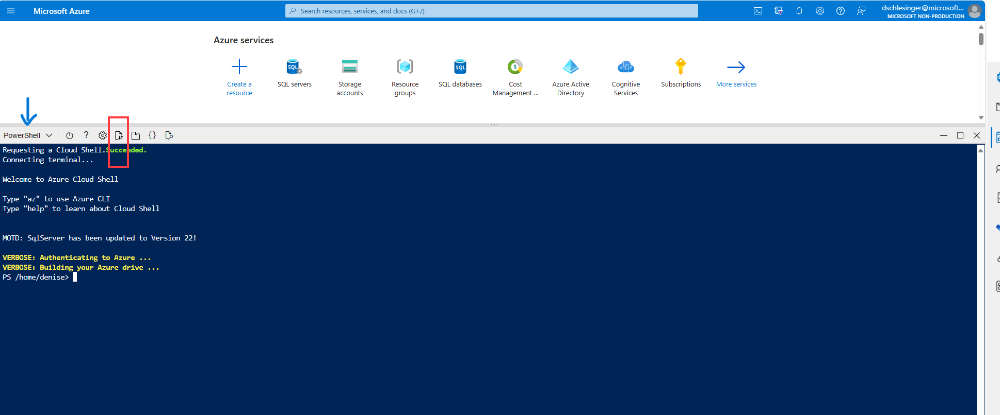

For this workshop you MUST have the following:

## Requirements
- Visual Studio Code
- Install VS Code Python Extension (Click on the Extensions icon in the left-hand side menu, Search for “Python” in the search bar, Click “Install” next to the “Python” extension)
- Python 3.7
- A virtual environment tool (venv)
- An Azure account with Open AI access granted

## Preparation

## OpenAI subscription and deployments
* Create an Azure OpenAI resource with your unique name and given region > [Steps](https://learn.microsoft.com/en-us/azure/ai-services/openai/how-to/create-resource?pivots=web-portal#create-a-resource) (Select Option 1: Allow all networks)
* Create 'gpt-35-turbo','text-embedding-ada-002' &  'text-davinci-003' deployments > [Steps](https://learn.microsoft.com/en-us/azure/ai-services/openai/how-to/create-resource?pivots=web-portal#deploy-a-model)

### VsCode
* Install [Visual Studio Code](https://code.visualstudio.com/) if not installed.

### Python
* Install [Python 3.7](https://www.python.org/downloads/release/python-31011/) (Python version must be <= 3.11 if you have higher version installed)

### Clone the Open AI workshop Git repo
Using Windows/Mac Terminal
```
git clone git@github.com:rohit2git/Azure-OAI-workshop.git
```
### Python3 Virtualenv Setup
*  Installation
        To install virtualenv via pip run:
        ``` 
            $ pip3 install virtualenv
        ```
* Creation of virtualenv:
    - Windows
    ```
    $ python -m virtualenv venv (in the openAI workshop directory)
    ```
    - Mac
    ```
    $ virtualenv -p python3 <desired-path>
    ```
* Activate the environment
    - Windows:
    ```
        .\venv\Scripts\activate.ps1
    ```
    - Mac
    ```
    $ source <desired-path>/bin/activate
    ```

### Install all libraries in your virtual environment

* Make sure you have the requirements installed in your Python environment using (in the openAI workshop directory)
```
pip install -r requirements.txt
```

### Create a sample Azure SQL DB with Adventureworks sample data
* Open the workshop repo folder in VS Code editor.

* Insert your [subscription ID](https://learn.microsoft.com/en-us/azure/azure-portal/get-subscription-tenant-id#find-your-azure-subscription) in the file [createAll.ps1](./scripts/createAll.ps1). Add your unique identifier in YOUR_UNIQUE_IDENTIFIER you are using common Azure subscription. Add Azure region given to you. Save the file.
    ```
    $SubscriptionId = '<AZURE SUBSCRIPTION ID>'
    $yourUniqueIdentifier = "<YOUR_UNIQUE_IDENTIFIER>"  # e.g. "johnsmith"
    $location = "<AZURE_REGION>"
    ```
* Insert a name for your sql server and DB in the file [deployAll.bicep](./scripts/deployAll.bicep). For these names make sure to add unique identifier to your sql server as its common Azure subscription you all are using. Add Azure region given to you. The DB server endpoint will be needed in next steps.
    ```
    param serverName string = '<SQLSERVERNAME>'
    param databaseName string = '<SQLDBNAME>'
    param location string = '<AZURE_REGION>'
    ```
* This powershell script will create:
    * A Resource group ```"rg-openai-workshop-"+ yourUniqueIdentifier + "-" + randomstring"```
    * An Azure SQL server called "<SQLSERVERNAME>+ randomstring", SQL DB(with an AdventureWorks DB) and Firewall rule 

* Login to the azure portal and login with a user that has administrator permissions
* Open the cloud shell(in PowerShell mode) in the azure portal as follows:


* Upload the files in the scripts folder: "createAll.ps1" and "deployAll.bicep" ONE BY ONE by using the upload file button in the cloud shell


* Run ./createAll.ps1

NOTE: This takes time(~5 minutes) so be patient
You should get an Azure SQL server with a DB name as you passed for <SQLDBNAME>


## Azure Cognitive services speech
* Go to Azure portal and [Create a Speech resource](https://portal.azure.com/#create/Microsoft.CognitiveServicesSpeechServices). Select the Resource group created above, give your unique name and region.

Now all the necessary resources in Azure portal are deployed. 

# IMPORTANT!
### Setup environment variables
* Rename the '.env.template' file to '.env' and modify all the endpoints and api keys for all openai deployments as follows:
```
OPENAI_DEPLOYMENT_ENDPOINT ="<your openai endpoint>" 
OPENAI_API_KEY = "<your openai api key>"

OPENAI_DEPLOYMENT_NAME = "<your gpt35 deployment name>"
OPENAI_DEPLOYMENT_VERSION = "<gpt35 api version>"    #"2023-07-01-preview"

OPENAI_ADA_EMBEDDING_DEPLOYMENT_NAME = "<your text embedding ada deployment name>"

OPENAI_DAVINCI_EMBEDDING_DEPLOYMENT_NAME = "<your text embedding ada deployment name>"

SQL_SERVER="<SQLSERVERNAME>.database.windows.net"
SQL_USER="SqlAdmin"
SQL_PWD="ChangeYourAdminPassword1"
SQL_DBNAME="<SQLDBNAME>"

# cognitive services speech - Keys and Endpoint

SPEECH_KEY       = "<your speech key>"
SPEECH_REGION    = "<your speech region>"

```

Save the above file. This completes your environment setup.

## Test the setup

Once the enviornment is setup its best to test if everything is working.

1. From the VS Code left pane, go to the a Jupyter notebook called [Setup-test.ipynb](Setup-test.ipynb) and open it.

2. From top right corner click on the 'Select kernel' button. It will open the Command pallete with avilable python environments, select the one with name 'venv' which we created and activated at the beginning of this file. If the environment not set properly, you will not able to run the lab exercises.

3. The from the Setup-test.ipynb note book run first cell. To run hover the mouse and click on Run button

This will take 10-15 seconds. This will load all the environment variables in memory.
If everything is correct the this cell will run without error.

4. Now calling the gpt35-turbo model asking some simple question. Run the second cell of the notebook.
If the environment variables are correctly given, then this cell will execute correctly and will give output like
``` ChatCompletion (gpt-35-turbo) :Good morning! As an AI language model, I don't have emotions, but I'm here to assist you with any question you have. How can I help you today?```
If you see above output then the Setup is complete and you are ready for the workshop.
If you don't get above output or get any errors, you need to check the errors, may be correct the environment variables(mostly) and click on "Restart" one top menu to reload the python environment and start executing cell 1 again.
5. Once you are done with above, we are ready for workshop labs.